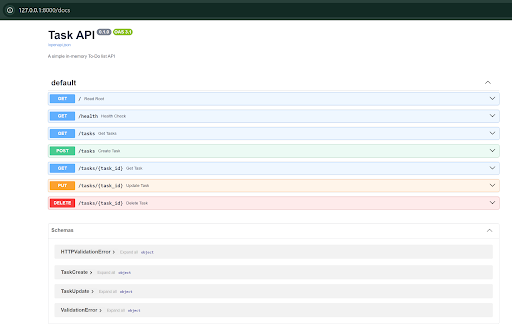

# Task API — Building CRUD API 🚀
A lightweight, in-memory RESTful To-Do list API built with **FastAPI**, **Pydantic**, and **Uvicorn**.


## 📖 API Interactive Documentation

### Swagger UI Overview 



### 🛠️ How to Install & Run
1. **Clone the repository:**
   ```bash
   git clone <https://github.com/FathimaWarda963/BuildingCRUDAPI>
   cd BuildingCRUDAPI


### Install Dependencies 
pip install fastapi uvicorn pydantic


### Run the server 
uvicorn main:app --reload


### Access Swagger UI: 
Open http://127.0.0.1:8000/docs in your browser. 


### API Endpoints
__________________________________________________________________________________________________________
| Method     | Endpoint           | Description                           | Status Code                   |
|------------|--------------------|---------------------------------------|-------------------------------|
| **GET**    | `/`                | Root endpoint displaying API metadata | 200 OK                        |
| **GET**    | `/health`          | Server health check monitor           | 200 OK                        |
| **GET**    | `/tasks`           | Retrieve all tasks from storage       | 200 OK                        |
| **GET**    | `/tasks/{task_id}` | Fetch a single task by ID             | 200 OK / 404 Not Found        |
| **POST**   | `/tasks`           | Create a new task (requires title)    | 201 Created / 400 Bad Request |
| **PUT**    | `/tasks/{task_id}` | Update task title or done status      | 200 OK / 400 / 404            |
| **DELETE** | `/tasks/{task_id}` | Remove a task by ID                   | 204 No Content / 404          |
|____________|____________________|_______________________________________|_______________________________|


### Sample curl -i Execution Output 
Testing Single Task Retrieval with curl -i http://127.0.0.1:8000/tasks/1
HTTP/1.1 200 OK
date: Wed, 19 Aug 2026 00:28:59 GMT
server: uvicorn
content-length: 56
content-type: application/json

{"id":1,"title":"Sand basswood strips🪵","done":false}


